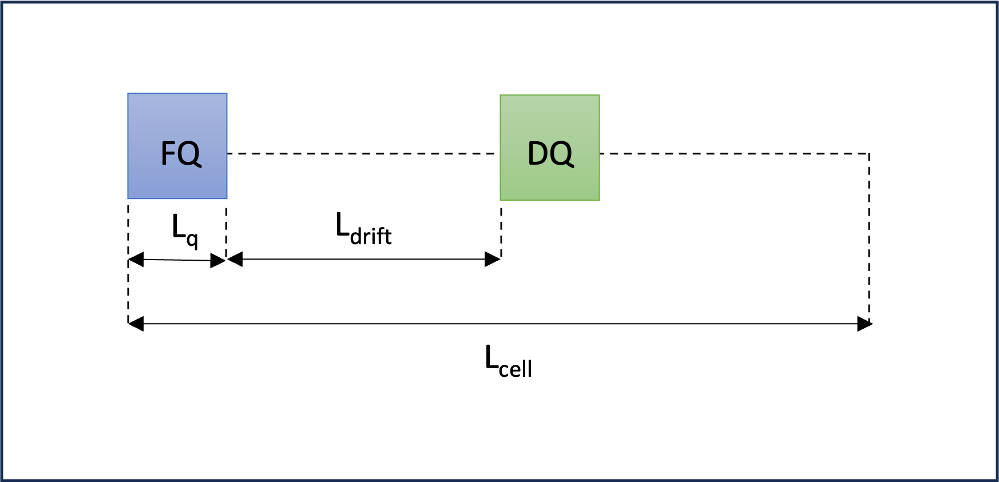
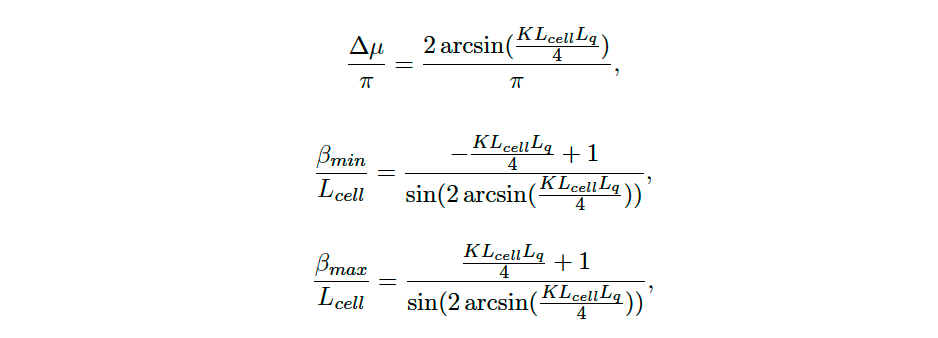
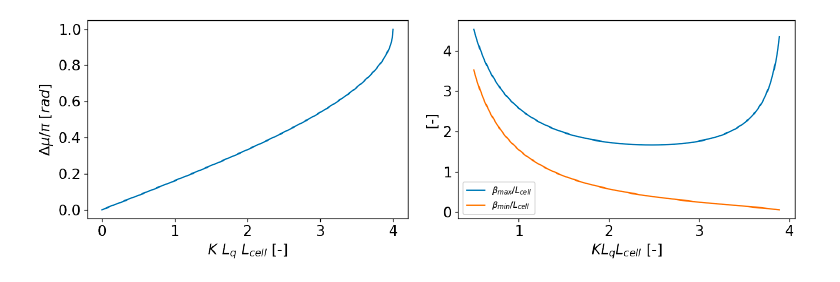

# MAD-X WORKSHOP JUAS 2024
**N. Fuster-Marti­nez, G. Sterbini, D. Gamba, S. Kostoglou, J. Olivares** 

## Tutorial 1: My first accelerator, a FODO cell

The main goal of this tutorial is to learn how to define a simple magnetic lattice and compute the linear optics functions using MAD-X. For that, we are going to define a FODO lattice, which is the simplest configuration we can design to get a net focusing effect of the beam in both transverse planes.

Questions:
    
1.    Define a FODO lattice with:

      - the length of the cell, $L_{cell}$ = 100 m,
      - two quadrupoles, one focusing (FQ) and another one defocusing (DQ), of 5 m long ($L_{q}$),
      - the start of the sequence placed at the start of the first quadrupole,
      - the quadrupole focal length f = 200 m. HINT: K1 x $L_{q}$= 1/f.
  

Figure 1: FODO cell scheme with main parameters depicted.

   

2. Define a proton beam with a total energy, $E_{tot}$, of 2 GeV. Activate the sequence and compute the periodic linear optics functions with the twiss MAD-X command. Then, plot the $\beta$-functions. If you found a maximum $\beta$-function of 460 m you succeeded!

3. Using the $\beta$-function plot obtained, can you estimate the phase advance of the cell? How does this value compare to the tune computed by MAD-X.
    
4. Try to run the twiss command with $E_{tot}$ = 0.7 GeV. What is the MAD-X error message? And if you change the focal length to 20 m? Note that the error messages will appear in the terminal from which you launched the JupyterLab.

## Tutorial 2: My first matching

The main goal of this tutorial is to study the behavior of the linear optics functions when we vary the FODO cell magnetic properties. For that, we will use the linear thin lens optics solution and the twiss MAD-X module. The results of the two approaches will be compared and discussed.

By considering the periodic solution of the equation of motion for a FODO cell, and applying the thin lens approximation and the stability condition, we can derive the following relationships between the optical parameters, the magnet properties and the cell length:

Figure 2: FODO cell equations relating linear optics parameters and magnet and cell characteristics.

  

Figure 3: Phase advance (left) and maximum and minimum $\beta$-functions as a function of the FODO magnets and cell characteristics.

  

Questions:

1. Using the thin lens approximation solution form Fig. 3 (left) compute the required strength to power the quadrupoles to obtain a phase advance in the FODO cell of 90 degrees. Using the calculated K value, compute the linear optics functions using MAD-X. What is the phase advance computed by MAD-X?

2. And the $\beta_{max}$ value computed by MAD-X? Compare the obtained value with the thin lens approximation solution from Fig. 3 (right).

3. Reduce by half the focusing strength of the quadrupoles, what is the effect of it on the $\beta_{max}$, $\beta_{min}$ and $\Delta \mu$? Compare the obtained values with the thin lens approximation from Fig. 3.

4. Compute the maximum beam size, $\sigma_{x,y}$ ,ƒ assuming a normalized horizontal and vertical emittance, $\epsilon_n^{x,y}$, of 3 mrad mm and $E_{tot}$ = 7 TeV using the following relation:

    $\sigma_{x,y}=\sqrt{\frac{\beta_{x,y}\epsilon_n^{x,y}}{\gamma}}$
    
    where $\gamma$ stands for the relativistic factor.
